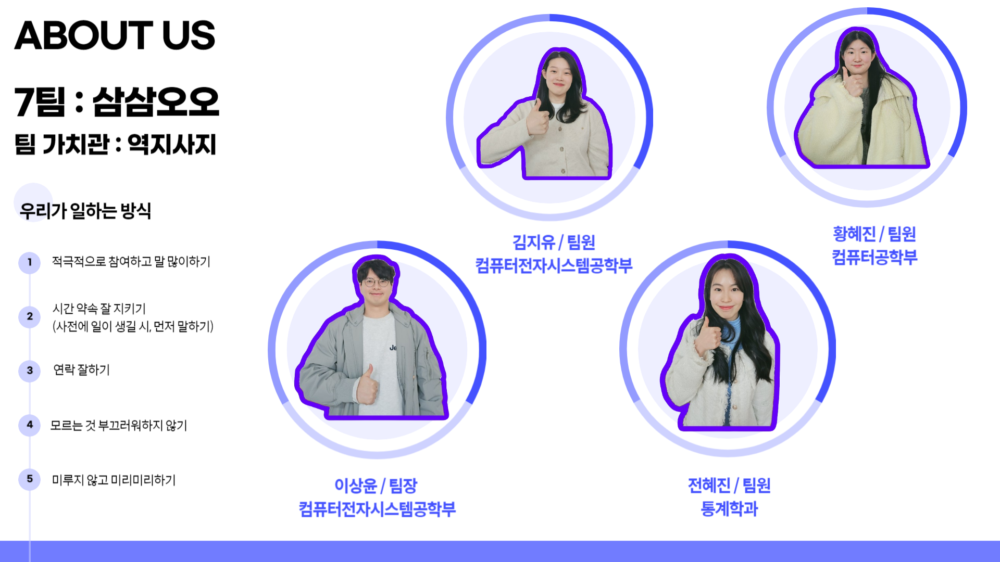

# '캡스톤 디자인' 팀 프로젝트 - FE Repitory

## 퓨처워크랩: 여행 코드 등록, 관리 및 추천 플랫폼

#### 여행 일정 추천 및 관리와 맞춤형 여행 경험을 제공하는 종합 여행 플랫폼의 개발

 

## 프로젝트 및 기업체 소개

**기업체: 퓨처워크랩 (Futurework Lab)**

  

### 프로젝트의 구성과 기능 및 특징

1. 맞춤형 여행 코스 제안 및 적합한 동행자를 찾아주기 위해,  
   <strong>웹 접속 시 간단한 선제적인 질문과 객관식/단답형 문항을 통해 데이터를 수집합니다.</strong>  
   질문의 선 제시는 사용자가 요구를 직접 생각해야 하는 부담을 최소화하면서도  
   효율적으로 특성을 파악할 수 있어, 양방향으로 유의미한 개선이 될 것입니다.

 

2. 위와 같은 개선을 기반으로 <strong>맞춤형 경험 플랫폼을 구축합니다.</strong>

- 추천 여행 코스와 더불어 개별 여행 코스 등록 및 관리 기능
- 반려동물과 함께 등 여행 일정 외 변수 고려가 가능한 기능

 

3. <strong>종합 여행 플랫폼으로 성장합니다.</strong>

- 숙박/교통/액티비티 관련 추천/등록/관리 및 예약 통합 서비스 구축  
  (단, ‘예약 통합 시스템’의 경우에 다른 기업과의 연계가 필요할 수 있으므로
  추후 상황을 고려하여 ‘예약 화면 바로가기’등의 형태로 대체될 수 있습니다.)
- 1인 여행자 타겟, 여행 스타일 및 특성 해시태그로 찾는 여행 동행자 매칭 기능  
  ex. #부산토박이 #역사덕후 #영어가능 등

  

## 팀소개

 

- **이상윤**: 웹 프론트엔드 개발(화면 디자인, 개발)
- **황혜진**: 웹 프론트엔드 및 추천 알고리즘 개발
- **김지유**: 백엔드 개발(DB 설계, API 개발)
- **전혜진**: 데이터 기반 기획 및 통계 모델 개발

  

## 페이지 흐름도

 
